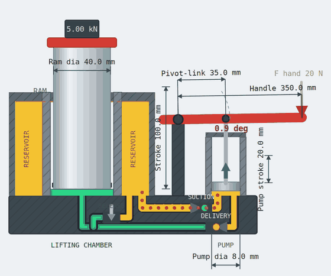

# Hydraulic Bottle Jack: Interactive Cross Section and Laboratory Materials

[](https://github.com/alibulentkoc/hydraulic-bottle-jack/actions/workflows/verify.yml)
[](https://doi.org/10.5281/zenodo.22181633)
[](LICENSE)
[](LICENSE-CONTENT.md)

A hydraulic bottle jack is the smallest complete fluid power system in common use.
It contains a reservoir, a positive-displacement pump, two check valves, a
directional control element, an actuator, and a set of passages, and it performs a
full hydraulic cycle: draw fluid, pressurize it, do work, hold the load, return the
fluid to tank. This repository holds an interactive cross section of that device
and the laboratory materials built around it.



**Run it now: <https://alibulentkoc.github.io/hydraulic-bottle-jack/>**

Everything runs in a browser from a local file. No server, no build step, no
network access, no dependencies at runtime.

## Contents

| File | What it is |
| --- | --- |
| `simulator/hydraulic-bottle-jack.html` | Interactive parametric cross section |
| `lab/bottle-jack-lab-handout.html` | Student handout: objectives, principles, procedure, data tables, questions 2 to 15 |
| `lab/bottle-jack-lab-answer-sheet.html` | Instructor answer sheet: live formulas, substitutions, and results |
| `tests/` | Verification suite, 121 checks |

Open any of the three files directly in a browser. The two laboratory documents
are formatted to print.

## The simulator

Drag the red handle, or use **Pump once** and **Auto pump**. Amber is reservoir
oil, green is pressurized oil. Every dimension is typed into the panel on the
right, in SI or US customary, and the drawing and all calculations follow.

The design rule throughout is that **physics drives the animation, not the
reverse**. The simulator maintains an explicit hydraulic state machine
(`SUCTION`, `COMPRESSION`, `DELIVERY`, `HOLD`, `RELEASE`, `MAX_EXTENSION`),
check valve states are derived from pressure relationships rather than set by the
animation, and the ram rises only by the volume the pump actually delivered:

```
A_pump * s_pump = A_ram * s_ram
```

The oil inventory bar under the drawing shows the same oil moving between the
reservoir, the pump chamber, and the lifting chamber, and it is a live check that
the model neither creates nor destroys fluid.

The drawing is schematic and not to scale, because a ram five times the diameter
of the plunger cannot be drawn at true relative size and still show the pump.
Screen scaling is kept entirely separate from the hydraulic calculation, which
always uses the dimensions as entered.

### Using it with a class

- **Pre-lab.** Students run the default jack and predict how many strokes reach
  full extension, then answer one question: if the ram diameter doubles, does the
  ram rise more or less per stroke, and does hand force go up or down?
- **During the lab.** Keep it closed. It shows the answers, and groups will read
  numbers off it instead of their calipers.
- **Post-lab.** Students enter their own measured geometry and check their hand
  calculations against it. Disagreement means an arithmetic error, since both use
  the same ideal model.
- **Demonstration.** Double the ram diameter and watch rise per stroke fall to a
  quarter while hand force falls to a quarter. That is the force-distance trade in
  about ten seconds.

## The laboratory activity

The activity is written for **jacks that have been drained of oil**, which is a
common constraint where cleanliness, disposal, or contact time rule out running
fluid. This changes what can be measured and therefore what can be concluded, and
the materials are built around that rather than in spite of it:

- Plunger stroke and handle swept angle are measured **before disassembly**, with
  a dial indicator and an angle gauge, because they are unavailable once the jack
  is apart.
- The reservoir annulus diameters are measured **while the jack is open**, and are
  flagged as unrecoverable after reassembly.
- With no efficiency measurement available, the analysis adds **uncertainty
  propagation**, so students identify which measurement dominates the result and
  why a squared term doubles its contribution.
- A **class-pooled study** plots rated capacity against lifting cylinder area
  across every jack in the room, from which students recover the working pressure
  a manufacturer designs a product family around.

The handout states eight core principles up front, including several that students
rarely articulate on their own: that a pair of check valves is what turns
reciprocating motion into one-way flow, that a seated ball holds a load at zero
input power, and that the release valve meters a descent driven by the load rather
than powering it.

Two defects in the traditional version of this lab are corrected and documented:
the prompt that asks for a "moment of inertia or torque" when the quantity is a
torque, and the prescribed arc-length method for operator work, which disagrees
with the lever-ratio result by a factor of theta/sin(theta), about 6 percent at
typical handle geometry.

## Verification

```
npm install     # jsdom, for the interface checks only
npm test
```

121 checks in six suites:

- **physics** (19): volume conservation across pump cycles and through the release
  valve, area-ratio scaling, load holding, stroke limiting, relief behaviour at
  full extension, mutual exclusion of the check valves, lever ratios.
- **geometry** (15): no hydraulic passage crosses another and nothing clips or
  collides, evaluated at the extremes of every user-editable dimension.
- **answer sheet** (12): internal consistency of the laboratory calculations,
  including that ideal speed reduction equals force multiplication exactly.
- **interface** (17): all three documents loaded in a headless DOM, controls
  exercised, unit round-trips checked.
- **labels** (10): no annotation overlaps another or leaves the canvas, checked
  at both dimension extremes and in both unit systems.
- **compatibility** (48): the source stays inside a conservative browser feature
  floor, and every feature that could fail silently is feature detected.

The suite runs on every push through GitHub Actions.

`tests/extract.js` pulls the runnable modules out of the single-file HTML using
the section-banner comments in the source. Those comments are the contract between
the artifacts and the suite: if one is renamed, extraction fails with an explicit
error rather than silently testing nothing.

## Browser support

Written to a conservative floor rather than to current browsers: ES6 syntax
(2015), no ES2017 or later library methods, no CSS feature newer than grid.
Tested constructs are limited to what Chrome, Firefox, Edge, and Safari have all
supported since roughly 2017, which covers the machines actually found in
teaching labs.

Three features that would otherwise fail silently are handled explicitly:

- **`paint-order`**, which gives labels a halo over the drawing, is feature
  detected. Where it is missing the halo is dropped, because an unsupported
  paint-order paints the stroke over the glyphs and hides the text.
- **Pointer events** drive the draggable handle where available, with a mouse
  and touch pair as the fallback, so dragging works on older iPads.
- **Flexbox `gap`** is not used at all, since Safari only gained it in 2021.
  Spacing comes from margins, which behave identically everywhere.

Screen coordinates are mapped into the drawing with `getBoundingClientRect`
alone, avoiding `getScreenCTM` and `SVGPoint`, both deprecated in SVG 2.

A `compatibility` test suite enforces all of this on every push, so the floor
cannot drift as the files are edited.

## Limitations

The model is ideal and quasi-static: no friction, no leakage past the check
valves, no fluid compressibility beyond a small allowance that produces a visible
compression phase, and no pressure drop in the passages. A real jack requires more
hand force and delivers less output power.

This matters pedagogically. The simulator and the students' hand calculations use
the same ideal model, so agreement between them confirms arithmetic and nothing
physical. Nothing in this laboratory validates the model against a real machine,
and the handout says so.

## Citation

Archived on Zenodo. Cite the concept DOI, which always resolves to the current
version, rather than a single version DOI:

> Koc, A. B. (2026). *Interactive Hydraulic Bottle Jack Cross Section and
> Laboratory Materials* [Software]. Zenodo.
> https://doi.org/10.5281/zenodo.22181633

All versions (concept DOI, cite this one):
[10.5281/zenodo.22181633](https://doi.org/10.5281/zenodo.22181633)

Live version: <https://alibulentkoc.github.io/hydraulic-bottle-jack/>

See `CITATION.cff`, or use the "Cite this repository" button on GitHub.

## License

Code is released under the MIT License (`LICENSE`). Instructional content, meaning
the handout and answer sheet and the text within them, is released under CC BY 4.0
(`LICENSE-CONTENT.md`).

## Contributing

Issues and pull requests are welcome, particularly from instructors adapting the
activity to different equipment or constraints. Run `npm test` before opening a
pull request; the same suite runs in CI.
